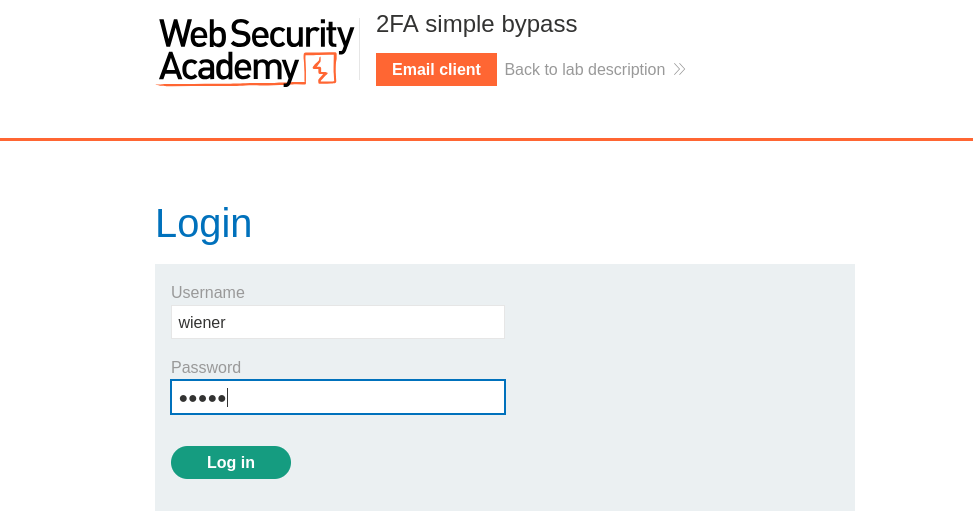
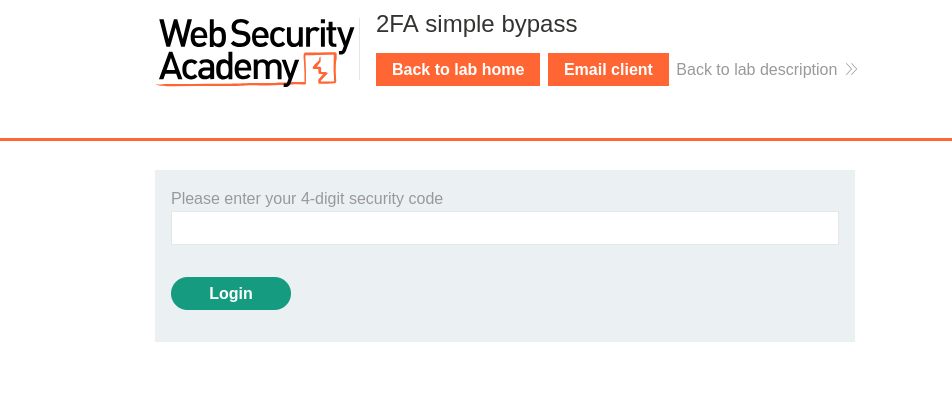
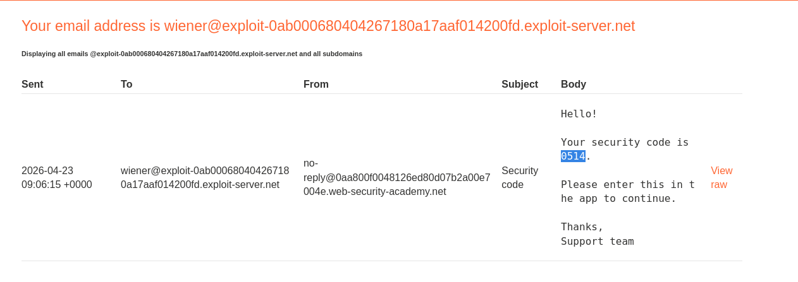
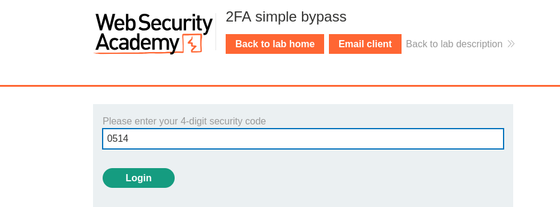
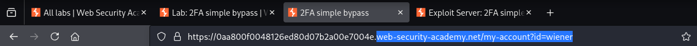
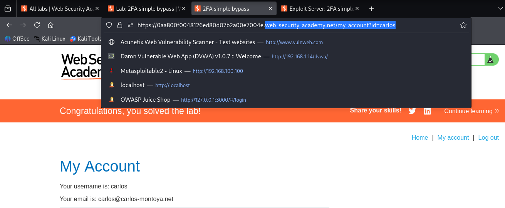

# 🔐 2FA Bypass - PortSwigger Lab

## 🎯 Objective

The goal of this lab is to bypass the two-factor authentication (2FA) mechanism and gain unauthorized access to another user's account.

## 🧠 What is 2FA Bypass?

Two-Factor Authentication (2FA) is a security mechanism that requires a second form of verification after entering valid credentials.

A 2FA bypass occurs when an attacker is able to access an account without completing the second authentication step, often due to improper implementation or missing authorization checks.

## 🔍 Recon

The application provides a login functionality followed by a 2FA verification step.

After loggin in with valid credentials, a 4-digit code is required, which is sent to the user's email through an internal email client.

## 💥 Exploitation

After successfully logging in as "wiener", access to the account page was granted at:

/my-account?id=wiener

It was observed that the account identifier is passed as a URL parameter.

By modifying the parameter value from "wiener" to "carlos", it was possible to access Carlos's account without completing the 2FA verification step.

## 🎯 Result

Access to Carlos's account was successfully achieved without providing the required 2FA code.

This demostrates a broken access control vulnerability, where the application fails to properly enforce authorization checks.

## ⚠️ Impact

An attacker can bypass the 2FA mechanism and gain unauthorized access to other user accounts.

This could lead to account takeover and exposure of sensitive user information.

## 🧠 Key Takeaways

- 2FA mechanisms can be bypassed if authorization checks are not properly implemented
- User-controlled parameters in URLs can lead to unauthorized access
- Broken access control vulnerabilities are common and highly impactful
- Security mechanisms like 2FA are ineffective if not properly enforced

## 🛡️ Mitigation

- Implement proper authorization checks on all user actions
- Do not rely solely on client-side or URL parameters for access control
- Ensure that 2FA is enforced consistently for all sensitive operations
- Validate that the authenticated user matches the requested resource

## 📸 Screenshots

### Login (Wiener)

### 2FA Code Request

### Email with Code

### Account Access (Wiener)

### URL Parameter (id=wiener)

### Lab Solved (id=carlos)

