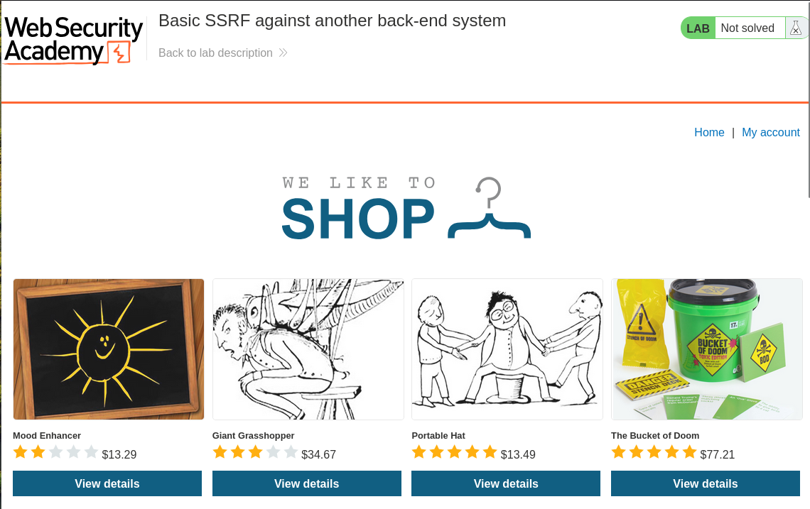
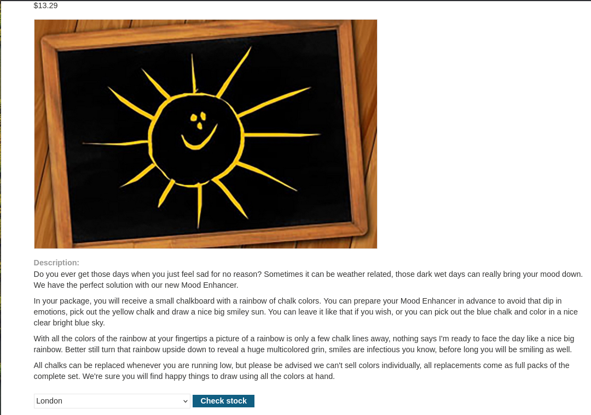
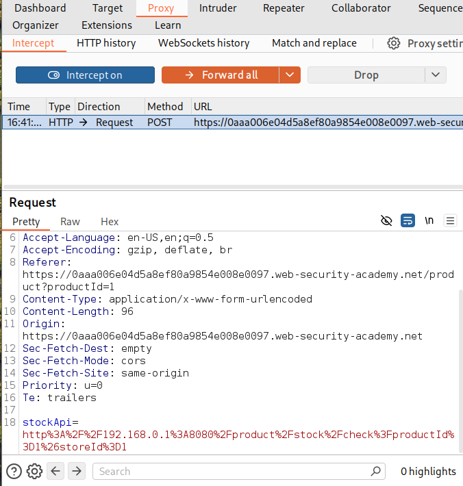
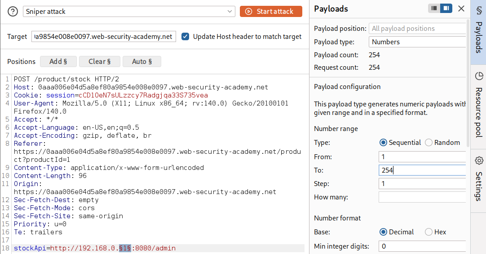
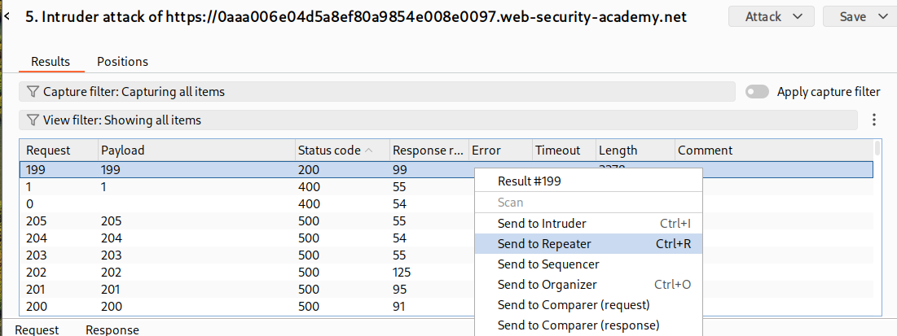
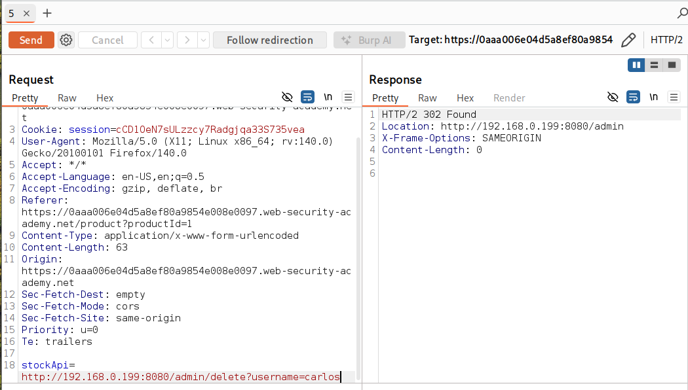
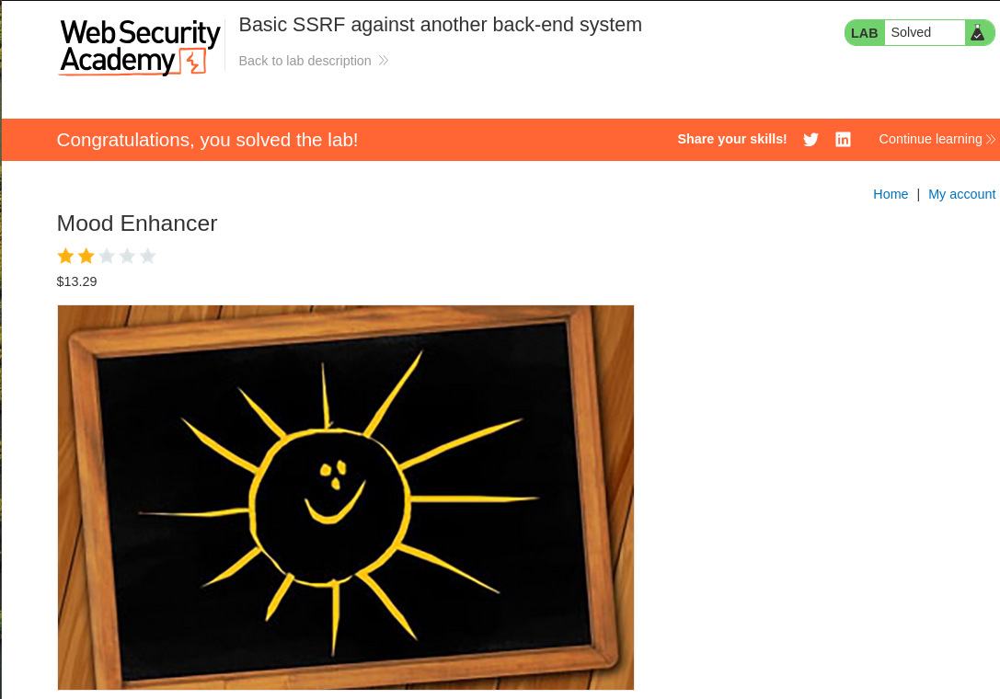

# SSRF - Basic Lab (PortSwigger)

## 🎯 Objective

The goal of this lab is to exploit a Server-Side Request Forgery (SSRF) vulnerability in the stock check functionality to access an internal administrative interface.

## 🧠 What is SSRF?

Server-Side Request Forgery (SSRF) is a vulnerability that allows an attacker to make the server send requests to internal or external systems.
This can be used to access internal services that are not normally accessible from the outside.

## 🔍 Recon

While exploring the application, a "Check stock" feature was identified on the product page.
By intercepting the request using Burp Suite, it was observed that the application uses the 'stockApi' parameter to fetch stock information from an internal system.

## 💥 Exploitation

The 'stockApi' parameter was modified to target internal IP addresses.
Using Burp Intruder, the last octet of the IP address was fuzzed from 1 to 254 to identify internal hosts.

## 🎯 Result

One of the requests returned a valid response from an internal administrative interface.
This allowed access to the admin panel, where the user "carlos" was deleted to complete the lab.

The objective of the lab was successfully achieved.

## 🧠 Key Takeaways

- SSRF vulnerabilities can be used to access internal systems
- Internal network enumeration is possible through SSRF
- User-controlled parameters that trigger server-side requests are dangerous
- Burp Intruder can be used to automate internal host discovery

---

## Impact

In a real-world scenario, this SSRF vulnerability could allow an attacker to access internal services that are not exposed publicly, including administrative interfaces or sensitive internal endpoints. Depending on the environment, SSRF may also be abused to interact with cloud metadata services, enumerate internal infrastructure, or pivot into deeper parts of the network.

---

## 🛡️ Mitigation

- Validate and sanitize user input
- Restrict server-side requests to trusted destinations
- Implement allowlists for allowed resources
- Block access to internal IP ranges (e.g., 127.0.0.1, 192.168.x.x)

---

## 📸 Screenshots

### Initial Page

### Product Page

### Intercepted Request

### Intruder Configuration

### Intruder Results

### Repeater Response

### Lab Solved

