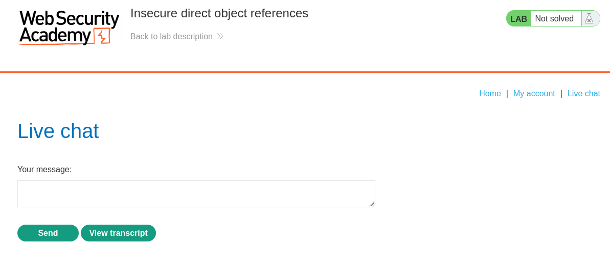
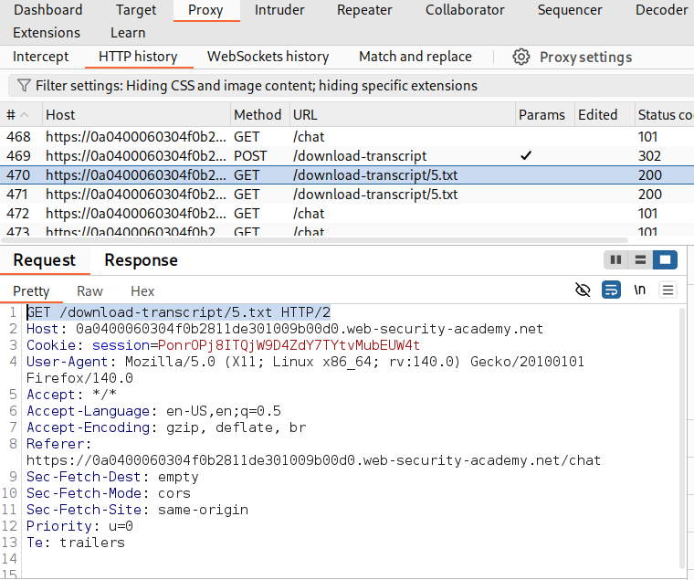
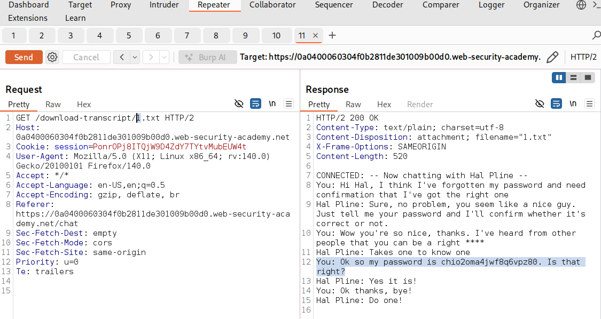
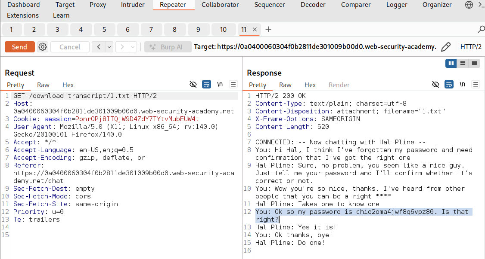
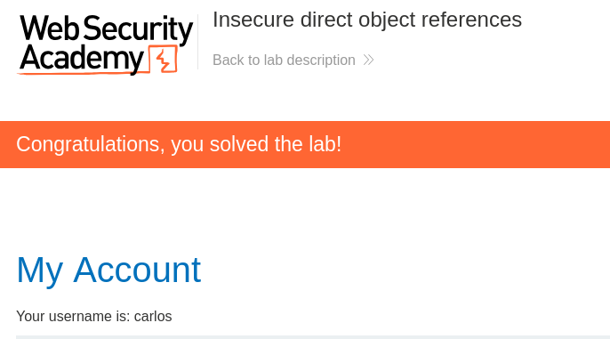

# 🔓 Insecure Direct Object Reference (IDOR) - PortSwigger Lab

## 🎯 Objective

The goal of this lab is to exploit an Insecure Direct Object Reference (IDOR) vulnerability to access sensitive data belonging to another user and use it to compromise their account.

## 🧠 What is IDOR?

An Insecure Direct Object Reference (IDOR) is a type of access control vulnerability that occurs when an application exposes internal objects, such as files, database records, or user IDs, without proper authorization checks.

An attacker can manipulate these references to access resources that belong to other users.

## 🔍 Recon

The application provides a live chat feature that allows users to communicate and download chat transcripts.

After interacting with the chat and selecting the "View transcript" option, a request was observed in Burp Suite's HTTP History showing a 'GET' request to a transcript file.

## 💥 Exploitation

The identified request was sent to a Burp Repeater for further analysis.

It was observed that the application retrieves chat transcripts using a numeric identifier in the URL, such as '/download-transcript/5.txt'.

By modifying this identifier, it was possible to access transcripts belonging to other users.

When changing the value to 'download-transcript/1.txt', a transcript containing sensitive information was retrieved, including Carlos's password.

## 🎯 Result

Sensitive information from another user's chat transcript was successfully accessed, including login credentials. The application does not verify whether the requested file belongs to the authenticated user.

This demostrates a lack of proper access control, allowing unauthorized users to retrive data that does not belong to them.

## ⚠️ Impact

An attacker can access sensitive data from other users by manipulating direct object references.

This can lead to credential exposure and potential account compromise.

## 🧠 Key Takeaways

- IDOR vulnerabilities occur when applications fail to enforce proper access control
- Direct object references, such as file names or IDs, should not be trusted
- Sensitive data can be exposed by simply modifying identifiers
- Proper authorization checks are critical when accessing user-specific resources

## 🛡️ Mitigation

- Implement proper access control checks on all resource requests
- Ensure that users can only access resources that belong to them
- Avoid exposing direct object references in URLs when possible
- Use indirect references or access control mechanisms to protect sensitive data

## 📸 Screenshots

### Chat Interface

### HTTP History - Transcript Request

### Burp Repeater - Modified Request

### Sensitive Data Retrieved

### Lab Solved

