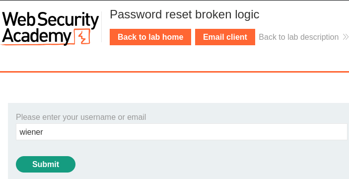
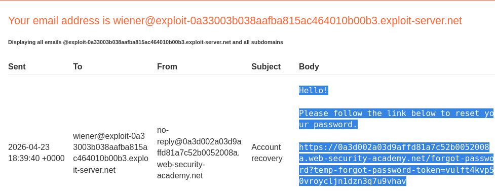
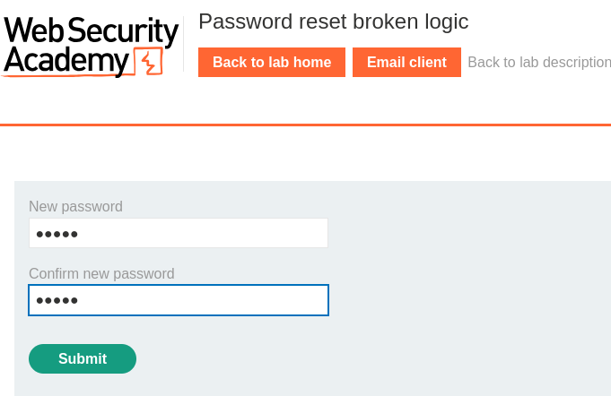
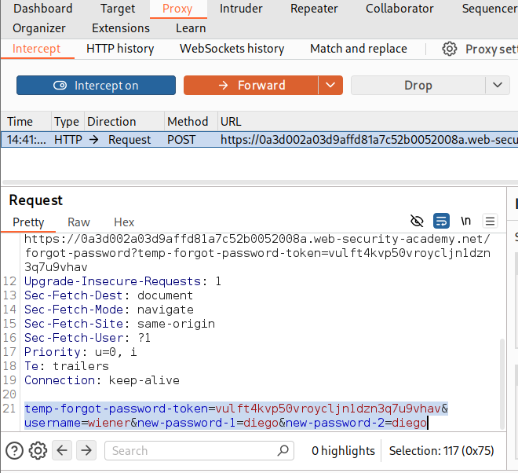
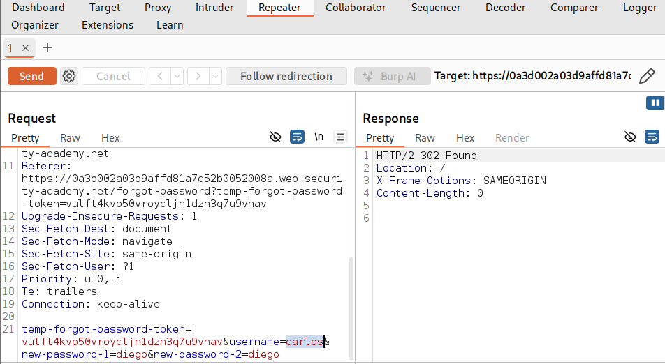
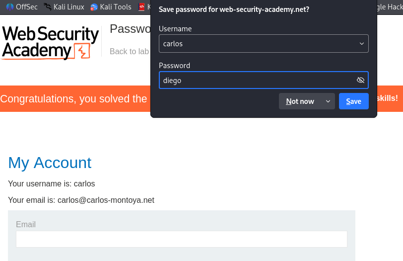

# 🔑 Password Reset Broken Logic - PortSwigger Lab

## 🎯 Objective

The goal of this lab is to exploit a vulnerability in the password reset functionality to gain unauthorized access to another user's account.

## 🧠 What is the vulnerability?

This lab demonstrates a flaw in the password reset functionality.

The application generates a valid password reset token but fails to properly validate that the token belongs to the intended user.

As a result, it is possible to reset another user's password by modifying the username parameter while using a valid token.

## 🔍 Recon

The application provides a password reset functionality through a "Forget password?" feature.

By submitting a valid username, the application sends a password reset link containing a token to the user's email via an internal email client.

## 💥 Exploitation

A password reset request was initiated for the user "wiener", generating a valid reset token.

The request was intercepted using Burp Suite, revealing that both the token and the username are included as parameters.

By sending the request to Burp Repeater and modifying the 'username' parameter from "wiener" to "carlos", it was possible to reset Carlos's password using a valid token that did not belong to him.

## 🎯 Result

Carlos's password was successfully reset without having access to his email account.

This demostrates a critical flaw in the password reset logic, allowing unauthorized account takeover.

## ⚠️ Impact

An attacker can reset the password of any user by manipulating the request parameters.

This can lead to full account takeover and compromise of sensitive user data.

## 🧠 Key Takeaways

- Password reset functionalities must validate token ownership
- User-controlled parameters can lead to critical vulnerabilities
- Broken logic vulnerabilities can allow full account takeover
- Proper validation is essential in authentication-related features

## 🛡️ Mitigation

- Ensure that password reset tokens are strictly bound to the intended user
- Validate all request parameters on the server side
- Avoid trusting user-controlled input for sensitive operations
- Implement additional verification steps during password reset processes

## 📸 Screenshots

### Forgot Password Request

### Email with Reset Token

### New Password Form

### Burp Intercept Request

### Burp Repeater Modified Request

### Lab Solved

