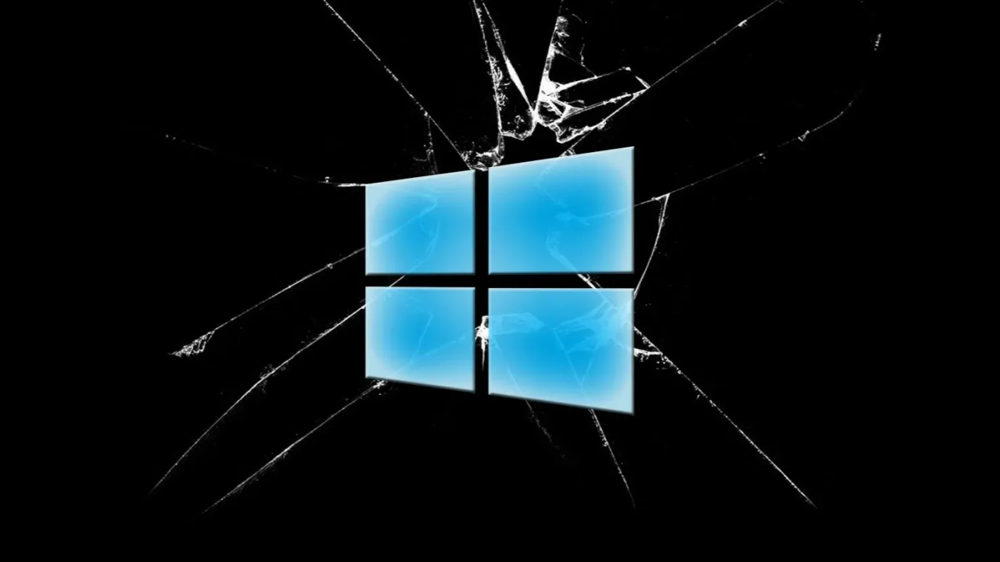
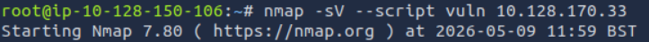
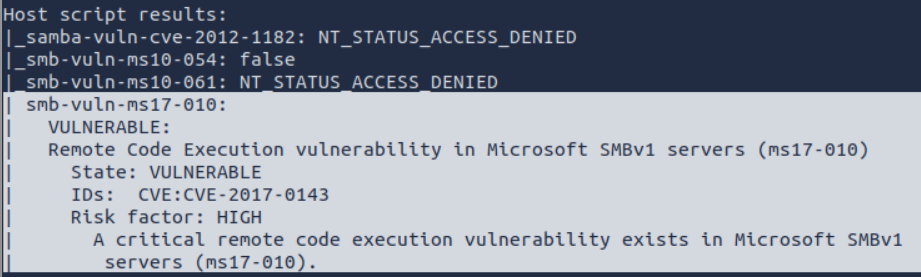
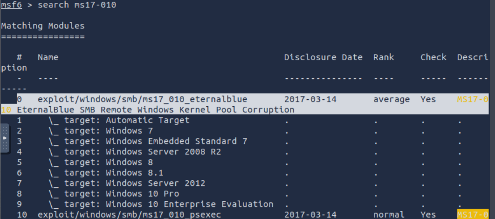
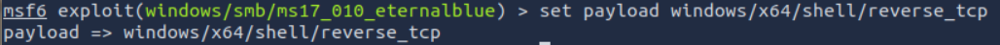
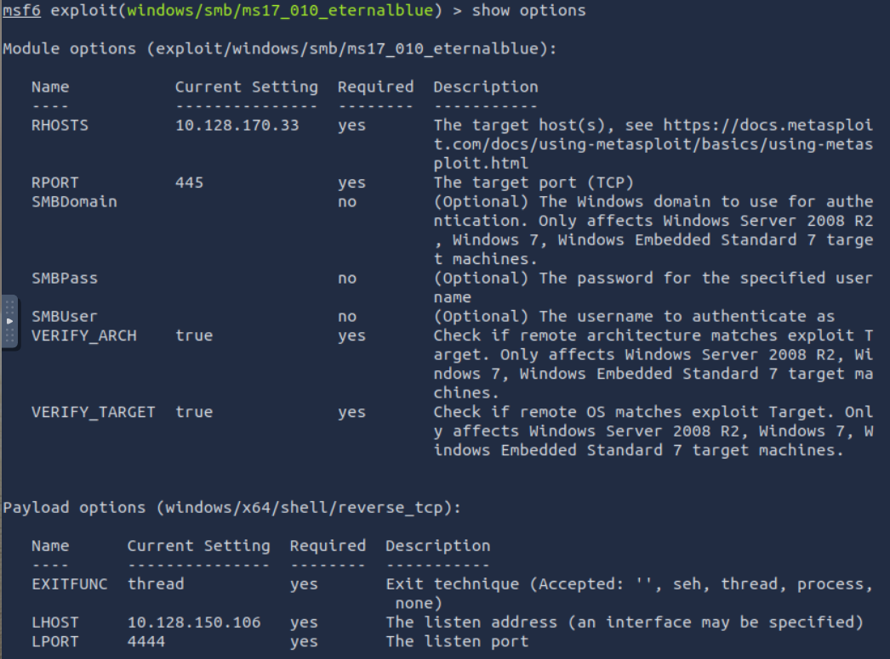
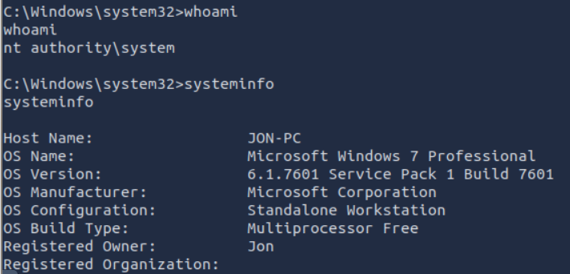
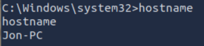

# 🪟 TryHackMe - Blue Writeup
---


<p align="center">
  
</p>

🔗 [TryHackMe Room - Blue](https://tryhackme.com/room/blue)


## 📖 Introduction


This writeup documents the exploitation of the TryHackMe **Blue** machine, a Windows target vulnerable to the SMBv1 vulnerability addressed in **MS17-010**, publicly exploited through **EternalBlue**.

The objective was to identify exposed SMB services, confirm the presence of the MS17-010 vulnerability, exploit it to gain remote code execution, and validate system-level compromise.

This machine is especially relevant because EternalBlue was one of the vulnerabilities abused during the WannaCry ransomware outbreak, demonstrating how an exposed and unpatched SMB service can lead to severe real-world impact.

---


## 🔎 Reconnaissance


An initial vulnerability-focused Nmap scan was performed against the target system to identify exposed services and detect known vulnerabilities.

```bash
nmap -sV --script vuln 10.128.170.33
```




The scan revealed that the target exposed the SMB service on port `445` and was vulnerable to **MS17-010**, a critical flaw affecting Microsoft SMBv1 implementations that enables remote code execution.

Nmap identified the vulnerability with the following result:

- `smb-vuln-ms17-010`
- State: `VULNERABLE`
- `CVE-2017-0143`





This vulnerability became widely known after being widely abused during the **WannaCry** ransomware outbreak in 2017.

---

## 🎯 Vulnerability Identification

The vulnerability scan identified the target as vulnerable to **MS17-010**, publicly exploited through **EternalBlue**.

MS17-010 is a critical vulnerability in the Microsoft SMBv1 protocol that allows unauthenticated attackers to execute arbitrary code remotely by sending specially crafted SMB packets to the target system.

Because SMB services are commonly exposed within enterprise environments, this vulnerability became highly impactful and was later weaponized by the **WannaCry** ransomware campaign in 2017.

The scan identified the following vulnerable service:

- Service: `SMBv1`
- Port: `445/TCP`
- Vulnerability: `MS17-010`
- CVE: `CVE-2017-0143`

Due to the severity of the vulnerability and the availability of public exploit modules, the target was considered vulnerable to remote compromise.

---

## 💥 Exploitation

After confirming the presence of the MS17-010 vulnerability, the Metasploit Framework was used to exploit the target SMB service.

The following EternalBlue exploit module was selected:

```text
exploit/windows/smb/ms17_010_eternalblue
```




A reverse TCP shell payload was configured to establish a command shell connection back to the attacking machine after successful exploitation.

The following payload was used:

`windows/x64/shell/reverse_tcp`





The exploit was configured with the target IP address (`RHOSTS`) and the attacker's listening host (`LHOST`) before execution.





Successful exploitation resulted in remote code execution on the target system and spawned a reverse shell connection with `NT AUTHORITY\SYSTEM` privileges.

---

## 🖥️ Post Exploitation

After successful exploitation, a command shell was obtained with `NT AUTHORITY\SYSTEM` privileges, providing full administrative control over the target machine.

Initial post-exploitation enumeration was performed to validate the compromise and identify system information.

The following commands were executed:

```cmd
whoami
systeminfo
hostname
```







The output confirmed that the target system was running:

- Microsoft Windows 7 Professional
- Service Pack 1
- Build 7601

The compromised shell was running with the highest level of privileges available on a Windows System:

`NT AUTHORITY\SYSTEM`

This level of access grants complete control over the operating system, including access to sensitive files, services, user accounts, and system configuration.

---

## 📌 Conclusion

This machine demonstrated how a single unpatched SMBv1 service can lead to complete system compromise through remote code execution.

By identifying the vulnerable SMB service and confirming that the target was vulnerable to **MS17-010**, it was possible to exploit the target remotely and obtain a shell with `NT AUTHORITY\SYSTEM` privileges.

Although the exploitation process itself was relatively straightforward, this vulnerability is historically significant due to its role in large-scale attacks such as the **WannaCry** ransomware outbreak, which impacted organizations worldwide in 2017.

This lab highlights the importance of:

- Disabling deprecated protocols such as SMBv1
- Applying security patches regularly
- Restricting unnecessary network exposure
- Monitoring exposed network services and restricting unnecessary access

Overall, the machine provides a practical introduction to Windows exploitation, SMB-based attacks, and the real-world impact of unpatched systems.

---

## ⚠️ Impact

The MS17-010 vulnerability allows unauthenticated remote attackers to execute arbitrary code on vulnerable Windows systems through the SMBv1 protocol.

Successful exploitation can result in:

- Full system compromise with `NT AUTHORITY\SYSTEM` privileges
- Remote Code Execution (RCE)
- Lateral movement across internal networks
- Deployment of ransomware or other malware
- Unauthorized access to sensitive files and system resources

Because SMB services are commonly exposed within enterprise environments, vulnerabilities such as EternalBlue can rapidly spread between systems if proper segmentation and patch management are not implemented.

This vulnerability became globally known after being widely abused during the **WannaCry** ransomware outbreak in 2017, which impacted hospitals, businesses, and government organizations worldwide.

---

## 🛡️ Mitigation

The following security measures can significantly reduce the risk associated with MS17-010 and similar SMB-based attacks:

- Disable the deprecated SMBv1 protocol whenever possible
- Apply Microsoft security patches related to MS17-010
- Restrict SMB access using firewalls and network segmentation
- Avoid unnecessary exposure of SMB services
- Implement endpoint detection and monitoring solutions
- Regularly audit systems for outdated services and missing security updates

Organizations should also maintain proper patch management procedures to prevent known vulnerabilities from remaining exploitable in production environments.

🔒 This lab demonstrates the severe impact of unpatched network services in real-world environments.
